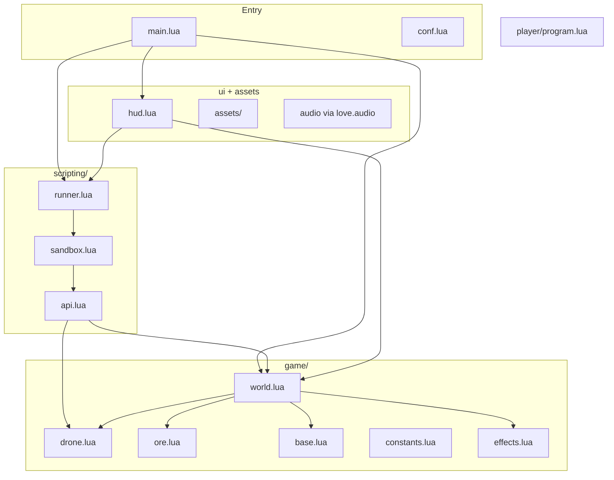

# 01 — Architecture

## Sơ đồ module



## Phân tách trách nhiệm

| Module | Trách nhiệm | Không được làm |
|--------|-------------|----------------|
| `main.lua` | LÖVE callbacks, wiring, input routing | Logic simulation chi tiết |
| `conf.lua` | Window size, title, modules | Gameplay |
| `game/world.lua` | Own world state, `update(dt)`, `draw()`, reset | Parse player script |
| `game/drone.lua` | Position, cargo, state machine, movement/mining/deposit | Expose mutable table cho player |
| `game/ore.lua` | Ore node data + mine logic | UI |
| `game/base.lua` | Base position + deposit logic | Script execution |
| `game/constants.lua` | Tuning numbers | Behavior |
| `game/effects.lua` | Particles, flashes, mining VFX | Core simulation rules |
| `scripting/runner.lua` | Coroutine lifecycle, RUN/STOP/RESET, budget | Draw UI |
| `scripting/sandbox.lua` | Build restricted `_ENV` | Game API implementation |
| `scripting/api.lua` | Bridge: blocking calls → drone intents | Direct coordinate set |
| `ui/hud.lua` | Panels, buttons, status text | World simulation |
| `player/program.lua` | Player-authored script | — |

## Hai world: simulation vs presentation

### Simulation tick (`love.update`)

Mỗi frame, theo thứ tự:

```text
1. runner.tick(dt)           -- resume coroutine, bounded instructions
2. world.update(dt)          -- drone movement, mining timer, deposit timer
3. effects.update(dt)        -- particles, pulses
4. hud.update(dt)            -- button hover, win overlay timer (nếu có)
5. audio housekeeping        -- loop drone hum volume, etc.
```

### Draw (`love.draw`)

```text
1. world.draw()              -- floor tiles, entities, effects
2. hud.draw()                -- overlay panels ON TOP
```

## Mô hình "blocking API" qua coroutine

Player viết code **tuần tự**:

```lua
move_to(nearest_ore())  -- "chờ" đến khi tới
mine()                  -- "chờ" đến khi đào xong
```

Bên trong, `api.lua` **yield** coroutine cho đến khi simulation báo action complete.

```text
Player coroutine calls move_to(target)
    → api records intent on drone: { type="move", target=... }
    → coroutine yields
    → [many frames] world.update moves drone
    → drone signals move complete
    → runner resumes coroutine
Player coroutine continues to mine()
```

Đây là pattern cốt lõi — **không dùng busy-wait loop trong player code space**.

## Drone intent model

`game/drone.lua` giữ:

```lua
drone = {
    x, y,
    cargo,
    state,           -- "idle" | "moving" | "mining" | "depositing"
    pendingAction,   -- nil hoặc { type, ... }
    moveTarget,      -- { x, y } hoặc ref
}
```

`scripting/api.lua` chỉ **set pendingAction** và **yield**. `world.update` **thực thi** và **clear** khi xong.

## Target reference model

`nearest_ore()` trả về **opaque target handle** — không phải bảng world raw.

Gợi ý implementation:

```lua
-- api.lua nội bộ
local targets = {}  -- weak refs hoặc id map

function nearest_ore()
    local node = world.findNearestOre(drone.x, drone.y)
    if not node then
        error("No ore nodes available")
    end
    return makeTarget("ore", node.id)
end

function move_to(target)
    if type(target) == "string" and target == "base" then
        requestMoveToBase()
    elseif isOreTarget(target) then
        requestMoveToOre(target.id)
    else
        error("Invalid move target")
    end
    waitUntilActionComplete()
end
```

Player **không** cần biết `target` là gì — chỉ pass qua `move_to`.

## Script runner states

```lua
runner.status = "idle" | "running" | "stopped" | "error" | "won"
runner.errorMessage = nil | string
runner.coroutine = nil | thread
```

| Event | Hành vi |
|-------|---------|
| RUN | Load `player/program.lua`, compile chunk, new coroutine, status=running |
| STOP | Kill coroutine, clear pending drone action, status=stopped |
| RESET | STOP + world.reset() + status=idle + clear error |
| Script error | pcall catch → status=error, show message |
| Budget exceeded | status=error hoặc stopped, message rõ |
| Win | world sets won flag → runner/status sync → status=won |

## Sandbox boundary

`sandbox.lua` tạo environment:

```lua
local env = {
    move_to = api.move_to,
    nearest_ore = api.nearest_ore,
    mine = api.mine,
    cargo = api.cargo,
    capacity = api.capacity,
    deposit = api.deposit,
    -- optional safe: print (có thể bật debug)
}
```

**Loại bỏ / không copy:** `io`, `os`, `package`, `debug`, `loadfile`, `dofile`, `require` (trừ khi whitelist nội bộ game modules — player không được gọi).

Compile:

```lua
local fn, err = load(chunk, "@player/program.lua", "t", env)
```

## Win flow

```text
deposit() completes
    → base.totalDeposited += drone.cargo
    → drone.cargo = 0
    → if totalDeposited >= WIN_ORE_TARGET then
          world.won = true
          runner.onWin()  -- stop script or let it error on next action
```

Khi WON: hiển thị overlay rõ ràng; script không nên âm thầm tiếp tục che kết quả.

## File load — không framework

```lua
-- assets: trực tiếp
love.graphics.newImage("assets/sprites/drone.png")

-- modules: require với path relative (main.lua setup package.path)
require("game.world")
```

Không Tiled loader, không JSON scene format, không hot reload phức tạp (reload program on RUN là đủ).

## Mở rộng sau V0.1 (chỉ thiết kế, không implement)

| Tương lai | Hook sẵn ở đâu |
|-----------|----------------|
| In-game editor | RUN reload `player/program.lua`; API không đổi |
| Nhiều level | `world.reset(config)` |
| Thêm API command | Thêm vào `sandbox env` + `api.lua` |
