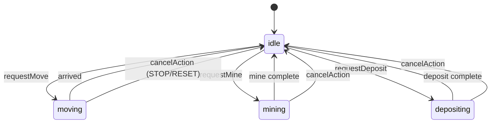

# 06 — Simulation

## Drone state machine



---

## Drone data model

```lua
Drone = {
    x = 80,
    y = 200,
    cargo = 0,
    capacity = 5,
    speed = 120,           -- pixels per second

    state = "idle",        -- idle | moving | mining | depositing

    -- moving
    targetX = nil,
    targetY = nil,

    -- mining
    miningOreId = nil,
    miningTimer = 0,

    -- depositing
    depositTimer = 0,

    -- animation
    bobPhase = 0,
    facingAngle = 0,
}
```

---

## Movement

### Algorithm — direct lerp (no pathfinding)

```lua
function Drone:updateMoving(dt)
    local dx = self.targetX - self.x
    local dy = self.targetY - self.y
    local dist = math.sqrt(dx*dx + dy*dy)

    if dist <= Constants.ARRIVAL_DISTANCE then
        self.x = self.targetX
        self.y = self.targetY
        self.state = "idle"
        return
    end

    local step = self.speed * dt
    local nx = dx / dist
    local ny = dy / dist
    self.x = self.x + nx * math.min(step, dist)
    self.y = self.y + ny * math.min(step, dist)
    self.facingAngle = math.atan2(dy, dx)
end
```

### Arrival

Khi `dist <= ARRIVAL_DISTANCE` → snap to target, `state = idle`.

API `waitUntil` predicate: `drone.state == "idle"`.

---

## Mining

### Start

```lua
function Drone:requestMine(oreNode)
    assert(self.state == "idle")
    local dist = distance(self, oreNode)
    if dist > Constants.MINING_RANGE then
        error("Not in range of ore")
    end
    if self.cargo >= self.capacity then
        error("Cargo full")
    end
    if not oreNode:hasOre() then
        error("Ore depleted")
    end
    self.state = "mining"
    self.miningOreId = oreNode.id
    self.miningTimer = Constants.MINE_DURATION
    world.effects.spawnMiningEffect(oreNode.x, oreNode.y)
end
```

### Update

```lua
function Drone:updateMining(dt, world)
    self.miningTimer = self.miningTimer - dt
    if self.miningTimer > 0 then return end

    local ore = world.getOreById(self.miningOreId)
    local extracted = ore:extract(Constants.ORE_PER_MINE)
    local space = self.capacity - self.cargo
    local gained = math.min(extracted, space)
    self.cargo = self.cargo + gained

    self.state = "idle"
    self.miningOreId = nil
end
```

### Ore extract

```lua
function Ore:extract(amount)
    local taken = math.min(self.remaining, amount)
    self.remaining = self.remaining - taken
    return taken
end
```

---

## Deposit

### Start

```lua
function Drone:requestDeposit(base)
    if distance(self, base) > Constants.BASE_RANGE then
        error("Not at base")
    end
    if self.cargo == 0 then
        return  -- no-op
    end
    self.state = "depositing"
    self.depositTimer = Constants.DEPOSIT_DURATION
    world.effects.spawnDepositEffect(base.x, base.y)
end
```

### Complete

```lua
function Drone:updateDepositing(dt, world)
    self.depositTimer = self.depositTimer - dt
    if self.depositTimer > 0 then return end

    local amount = self.cargo
    self.cargo = 0
    world.addDepositedOre(amount)
    self.state = "idle"

    if world.getDepositedOre() >= Constants.WIN_ORE_TARGET then
        world.triggerWin()
    end
end
```

---

## Ore nodes — initial layout

| ID | Position | Initial amount |
|----|----------|----------------|
| 1 | (400, 80) | 10 |
| 2 | (650, 200) | 10 |
| 3 | (400, 320) | 10 |

Total 30 available — đủ cho WIN 20 + buffer depleted node routing.

### `findNearestOre(droneX, droneY)`

```lua
function World:findNearestOre(x, y)
    local best, bestDist
    for _, ore in ipairs(self.ores) do
        if ore:hasOre() then
            local d = dist2(x, y, ore.x, ore.y)
            if not bestDist or d < bestDist then
                best = ore
                bestDist = d
            end
        end
    end
    return best
end
```

---

## Base

```lua
Base = {
    x = 80,
    y = 200,
    width = 64,   -- visual hit area
    height = 64,
}
```

`BASE_RANGE = 48` — drone center within range of base center.

---

## World reset

```lua
function World:reset()
    self.depositedOre = 0
    self.won = false
    self.drone:reset(self.initialDroneState)
    for _, ore in ipairs(self.ores) do
        ore:reset()
    end
    self.effects:clear()
end
```

Lưu `initialDroneState` lúc `init()`.

---

## Cancel action (STOP / RESET)

```lua
function Drone:cancelAction()
    self.state = "idle"
    self.miningOreId = nil
    self.miningTimer = 0
    self.depositTimer = 0
    self.targetX = nil
    self.targetY = nil
end
```

Không hoàn tất partial mine — đơn giản hóa V0.1.

---

## Animation — drone bob

```lua
function Drone:updateIdleAnim(dt)
    self.bobPhase = self.bobPhase + dt * 4
    self.bobOffset = math.sin(self.bobPhase) * 2
end
```

Draw at `y + bobOffset`.

---

## Collision / map

V0.1: **open map, no obstacles**. Drone đi thẳng tới target.

Không cần tile collision. Walls chỉ visual từ tilemap vẽ decorative.

---

## Distance helpers

```lua
local function dist(ax, ay, bx, by)
    local dx, dy = bx - ax, by - ay
    return math.sqrt(dx*dx + dy*dy)
end

local function dist2(ax, ay, bx, by)
    local dx, dy = bx - ax, by - ay
    return dx*dx + dy*dy
end
```

Dùng `dist2` cho nearest compare — tránh sqrt.

---

## Timing feel (starting values)

| Constant | Value | Note |
|----------|-------|------|
| `DRONE_SPEED` | 120 px/s | ~3-5s cross map |
| `MINE_DURATION` | 1.5 s | visible wait |
| `DEPOSIT_DURATION` | 0.6 s | snappy feedback |
| `ORE_PER_MINE` | 1 | 5 mines = full cargo |
| `CARGO_CAPACITY` | 5 | |
| `WIN_ORE_TARGET` | 20 | |

Tune sau M6 playtest — chỉ sửa `constants.lua`.

---

## Full cycle time estimate

```text
Per cargo fill: move + 5×mine + move back
≈ 4s move + 7.5s mine + 4s move + 0.6s deposit ≈ 16s per 5 ore
4 cycles × 16s ≈ 64s to WIN
```

Chấp nhận được cho vertical slice. Tăng `ORE_PER_MINE` nếu quá chậm.
