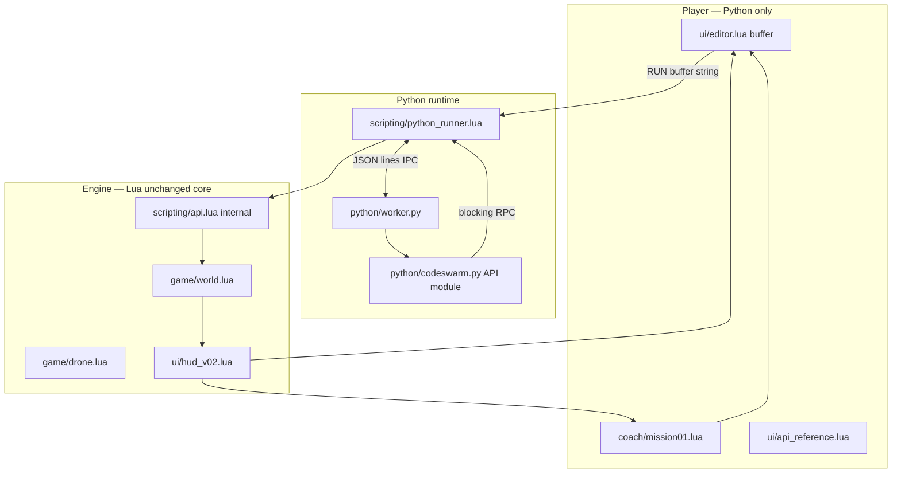

# V0.2 — 01 Architecture

## Sơ đồ tổng thể



## Nguyên tắc phân tầng

| Layer | Biết gì | Không biết gì |
|-------|---------|---------------|
| Player | Python, 6 API | Lua, LÖVE, file paths |
| `python/codeswarm.py` | 6 API, blocking | World internals |
| `python_runner.lua` | IPC, yield simulation | Python syntax |
| `scripting/api.lua` | Drone intents | Python |
| `game/*` | Simulation | Python |

## Luồng RUN (critical path)

```text
1. User presses RUN
2. editor:getText() → pythonSource string
3. python_runner.run(pythonSource)
4. Start/resume Python worker with script
5. Python calls codeswarm.move_to(...) 
      → worker writes {"cmd":"move_to","args":[...]} to stdout
      → lua reads, sets drone intent, yields until idle
      → lua writes {"cmd":"done"} to stdin
6. Repeat until script ends, error, WIN, STOP, or budget exceeded
7. Coach receives events (moved, mined, error) for feedback
```

**Source of truth:** `editor buffer` — **never** RUN stale file silently.

Persistence file is a **copy** of buffer for reload, not execution source unless explicitly loaded into editor on boot.

## Python runtime — quyết định kiến trúc (recommended)

### Chọn: **Bundled CPython embeddable + persistent worker subprocess**

| Lý do | |
|-------|---|
| Python thật | CPython 3.11+ embed zip |
| No user install | Ship `vendor/python/` trong repo hoặc installer |
| Sandbox | Worker bootstrap restricted `__builtins__`, chỉ import `codeswarm` |
| Blocking | IPC request/response per API call |
| STOP | Kill worker hoặc close stdin + terminate process |
| Spike-friendly | Prove trước khi polish editor |

### Không chọn (V0.2)

| Approach | Lý do reject |
|----------|--------------|
| Regex/transpile Python→Lua | Issue cấm |
| System `python` on PATH | Player phải cài |
| `lupa` / Lua in Python | Wrong direction |
| Full C extension embedding day 1 | Quá chậm cho spike |

### IPC protocol (gợi ý)

**Lua → Python (stdin):** one JSON object per line

```json
{"type":"run","source":"move_to(nearest_ore())\n"}
{"type":"resume","result":{"ok":true}}
{"type":"stop"}
```

**Python → Lua (stdout):**

```json
{"type":"call","fn":"move_to","args":["ore:1"],"call_id":42}
{"type":"error","message":"...","line":3,"kind":"SyntaxError"}
{"type":"done"}
{"type":"heartbeat"}
```

Lua `love.update` không block vô hạn: mỗi frame xử lý IPC + simulation tick.

## Blocking semantics (giống V0.1)

Python API **đồng bộ**:

```python
move_to(nearest_ore())  # returns when drone arrived
mine()                  # returns when mine complete
```

Implementation: worker gửi `call`, **block read** stdin cho `resume` — worker thread đợi. Lua side simulate frames, gửi `resume` khi xong.

## Anti-freeze

| Mechanism | |
|-----------|---|
| Worker process | STOP = terminate process |
| Wall-clock timeout | No `resume` for N sec → error |
| Instruction budget | `sys.settrace` hoặc signal in worker (platform-specific) |
| Main thread | LÖVE luôn responsive — không `dofile` Python on main thread |

Chi tiết: [05-python-runtime.md](./05-python-runtime.md)

## Coach integration

```text
Mission state machine (coach/mission01.lua)
    ← events from simulation (mined, deposited, error)
    → updates coach panel text
    → unlocks hint tier
    → optional: gate RUN until step objective met (soft gate — warn, don't block)
```

**Soft gating recommended:** luôn cho RUN, Coach giải thích nếu chưa đúng step.

## Error pipeline

```text
Python exception
    → worker serializes {type, message, line, offset}
    → python_runner sets status ERROR
    → coach/errors.lua maps to beginner message
    → editor highlights line
    → error SFX (reuse V0.1 audio)
```

Templates: [08-errors-and-hints.md](./08-errors-and-hints.md)

## Giữ gì từ V0.1

| Module | V0.2 |
|--------|------|
| `game/world.lua` | Giữ — simulation |
| `game/drone.lua`, ore, base, effects | Giữ |
| `scripting/api.lua` | Dùng nội bộ từ python_runner (Lua bridge) |
| `scripting/runner.lua` | Dev/QA only hoặc ẩn — **không** player UI |
| `player/program.lua` | Deprecated player path — `qa/` only |
| `ui/hud.lua` | Fork → `ui/hud_v02.lua` layout mới |
| Assets/audio | Không regression |

## Layout state

Single screen `GameState.PLAY_MISSION_01` — không menu phức tạp V0.2.

## Mở rộng sau V0.2 (chỉ thiết kế hook)

| Future | Hook |
|--------|------|
| Mission 02 | `coach/mission02.lua` |
| Level select | `GameState` enum |
| More API | Extend `codeswarm.py` + docs |

Không implement trong Issue #2.
